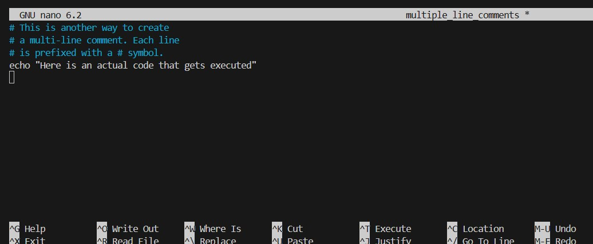

# linux-shell-scripting-comments

comments are essential notes to the programmer and anyone else who might read the code. comments can be single line comments or multiple line comments

screenshots below:

## Best Practices for Commenting
- comments should be clear and concise
- update comments as you the code is updated
- let the comments be usefull
- and avoid over commenting