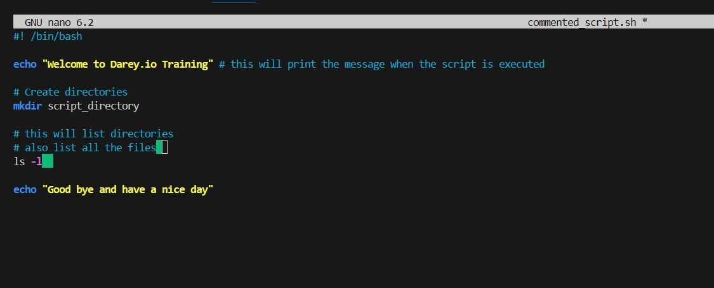
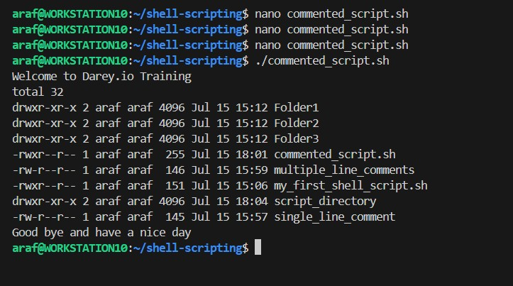

# linux-shell-scripting-comments

created commented_script.sh file and wrote the script in the screenshot attached. the file permission for the script was properly set to be executable. 

Both single line comments and multiple line comments were used in the script. Script was executed and the output is demonstrated in the screenhsots below:

## Best Practices for Commenting
- comments should be clear and concise
- update comments as you the code is updated
- let the comments be usefull
- and avoid over commenting